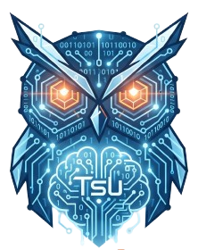

<div align="center">
<a href="https://tsudev.com"></a>

# Contributing

<a href="https://tsudev.com"><picture><source media="(prefers-color-scheme: dark)" srcset="assets/brand/tsudev-wordmark-dark.png"></picture></a> · <a href="https://tsudev.com">tsudev.com</a>
</div>

---

## The most useful contribution

**Rules for `data/safety-db.json`.** The engine is finished; the database
never is. Every machine has software this tool has not seen, and every
unclassified item is one more `Unknown` a user has to judge for themselves.

A rule:

```json
{
  "id": "vendor.product",
  "class": "safe",
  "match": {
    "kinds": ["registry_uninstall"],
    "exact": ["Vendor Product"],
    "contains": ["vendorproduct"],
    "publisherContains": "Vendor Inc"
  },
  "reason": {
    "en": "What it is and what removing it costs.",
    "vi": "Nó là gì và gỡ đi thì mất những gì."
  },
  "tags": ["bloatware", "oem"],
  "processes": ["Product.exe"],
  "services": ["ProductUpdater"],
  "leftovers": {
    "paths": ["%LOCALAPPDATA%\\Vendor\\Product"],
    "registry": ["HKCU\\Software\\Vendor\\Product"],
    "registryValues": ["HKCU\\Software\\Microsoft\\Windows\\CurrentVersion\\Run::Product"]
  }
}
```

Rules to follow when writing one:

* **Both translations are required.** A test enforces it.
* **Classify one step stricter than you think.** A wrong `caution` costs a
  click; a wrong `safe` costs the user a feature they never agreed to lose.
  See [docs/SAFETY.md](docs/SAFETY.md) for how the classes are decided.
* **Restrict `kinds` when the name is generic.** A rule matching `contains:
  ["update"]` with no `kinds` will fire on things you did not intend.
* **Residue paths use `%VARIABLES%`**, never a hard-coded `C:\Users\name`.
  Anything still containing a `%` at deletion time is rejected by the guard,
  which is the desired outcome for a typo.
* **Never add a `critical` rule that could be worked around.** If something is
  Critical, the point is that no user can remove it. Do not pair it with a
  narrower `safe` rule "for convenience" - severity wins, but the intent
  becomes unclear to the next reader.

Then:

```bash
cargo test -p cwico-core --features mock safety::
```

## Working on the engine

```bash
# Everything except the Windows syscalls runs anywhere
cargo test

# Type-check the Windows backend without a Windows machine
rustup target add x86_64-pc-windows-gnu
cargo check -p cwico-win --target x86_64-pc-windows-gnu

# The host-independent parts of the Windows crate have real tests
cargo test -p cwico-win
```

#### A note on cross-checking the desktop app

`cargo check -p cwico-app --target x86_64-pc-windows-gnu` gets as far as
Tauri's build script and then fails with
`NotAttempted("x86_64-w64-mingw32-windres")`. That is not a code error: the
build script has already parsed `tauri.conf.json` and generated the capability
files successfully, and only the step that embeds the Windows icon and version
resource needs a MinGW resource compiler.

Install one to get the full type-check on Linux:

```bash
sudo apt install binutils-mingw-w64-x86-64      # Debian/Ubuntu
sudo dnf install mingw64-binutils               # Fedora
```

`cwico-core`, `cwico-win` and `cwico-cli` all cross-check without it, and they
hold every line of logic that matters. The Tauri crate is IPC plumbing.

### Where code belongs

| If it… | Put it in |
|---|---|
| decides whether something is safe | `cwico-core` |
| is pure string, path or name logic | `cwico-core`, or one of `cwico-win`'s host-independent modules (`cmdline`, `naming`, `protected`) |
| calls a Win32 or WinRT function | `cwico-win` |
| is IPC plumbing | `app/src-tauri` |
| is presentation | `ui/` |

The rule behind the table: **`cwico-core` makes no OS calls**, which is what
lets its whole test suite - including every adversarial safety test - run on a
Linux CI runner. Adding a `#[cfg(windows)]` to that crate is a sign the logic
belongs somewhere else.

The three host-independent modules inside `cwico-win` exist for the same
reason. `UninstallString` parsing and AppX name derivation are where the
subtle bugs live; keeping them pure `std` means CI actually runs their tests
instead of only type-checking them.

## Working on the front end

> **Paths in `tauri.conf.json` have two different bases.** `frontendDist` is
> relative to `tauri.conf.json` itself (`app/src-tauri/`), while the
> `beforeDevCommand` and `beforeBuildCommand` hooks run from the *app
> directory* one level up (`app/`). That is why one says `../../ui/dist` and
> the other says `../ui`. Getting this wrong fails only in `cargo tauri
> build`, not in `cargo build`, so CI's Windows job will not catch it - the
> release workflow will.


```bash
npm --prefix ui install
npm --prefix ui run dev     # opens in a browser against src/fixtures.ts
```

The browser fixtures mirror the Rust `MockBackend`: one item of every safety
class and every source kind. If you change the planner's behaviour in Rust,
change `ui/src/fixtures.ts` to match - otherwise the interface you are
designing against is not the one that ships.

Notes:

* `ui/src/api.ts` is the only file that imports `@tauri-apps/api`. Everything
  else goes through it.
* `ui/src/i18n.ts` has a typed key space. A missing translation is a compile
  error, not a runtime surprise.
* Colours come from CSS custom properties in `index.css`. No hard-coded hex in
  a component - light and dark are the same code path.
* Colour is never the only signal. Safety badges carry a glyph and a word too.

## Adding a tweak

`data/tweaks.json`. Every tweak needs a `revert` path unless it is genuinely
one-way, in which case the UI labels it as such and a test asserts that
registry-only tweaks always have one.

`runCommand` effects are restricted to an allow-list (`powercfg`, `dism`,
`tzutil`, `netsh`) plus internal `cwico:` actions. This is deliberate: a
catalogue is data, and data that can execute arbitrary programs is a remote
code execution bug waiting for a poisoned update.

## Before opening a pull request

```bash
cargo fmt --all
cargo clippy --all-targets
cargo test
npm --prefix ui run build
python3 tools/check_docs.py   # if you changed a rule or tweak count
```

## Releasing

See **[docs/RELEASING.md](docs/RELEASING.md)**. In short:

```bash
tools/version.py set "$(tools/version.py next)"
# write the CHANGELOG entry - it becomes the text users read in the
# mandatory update dialog
git commit -am "Release $(tools/version.py current | awk '{print $1}')"
git tag "$(tools/version.py current | awk '{print $1}')" && git push --tags
```

Publishing the resulting draft pushes a **mandatory** update to every
installed copy, which is why the workflow drafts rather than publishes.
`gh workflow run release.yml` builds the same installers without touching
anyone.

## Commit style

Present tense, describe the effect rather than the mechanism:

```
Refuse deep clean on service registry keys

A service's key is the service. Sweeping it as "residue" deleted the
service definition outright, which no amount of re-enabling brings back.
```

## Reporting a safety bug

If you find a way to make the tool remove something it should not, please open
an issue with the item's `id`, its classification, and what happened. That is
the highest-priority class of bug in this project.
