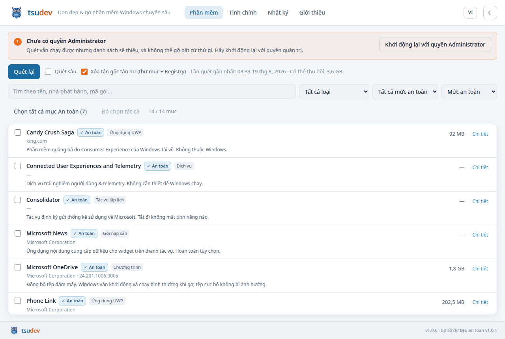
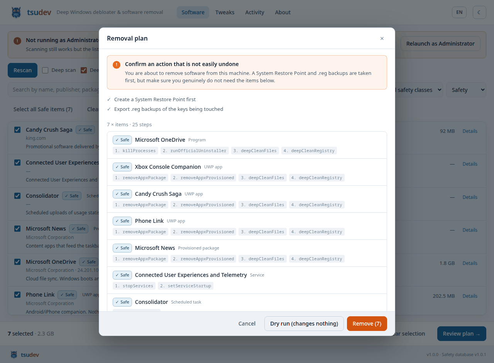
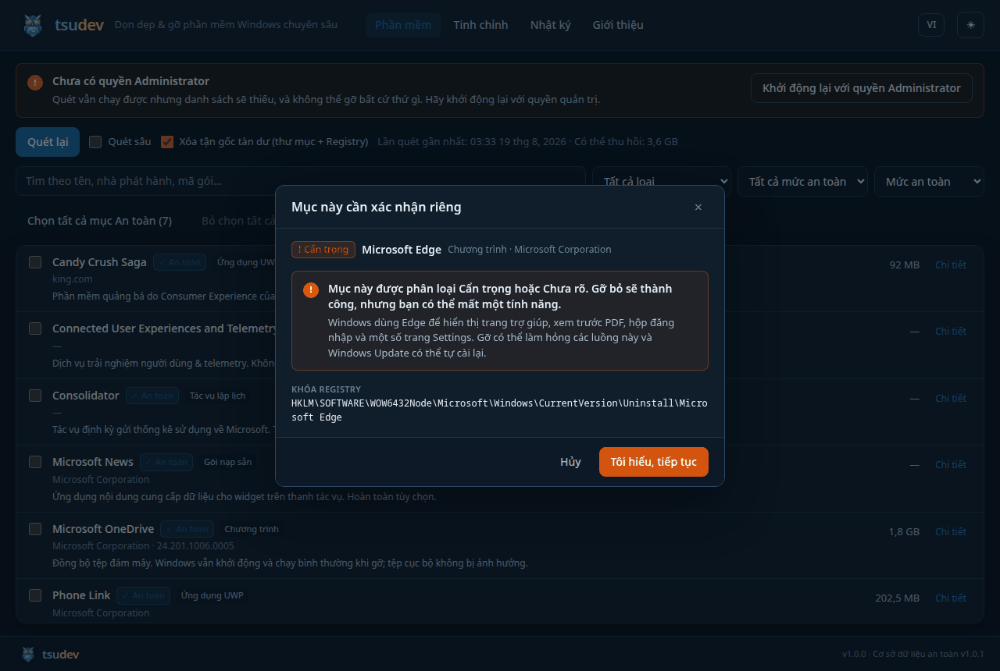
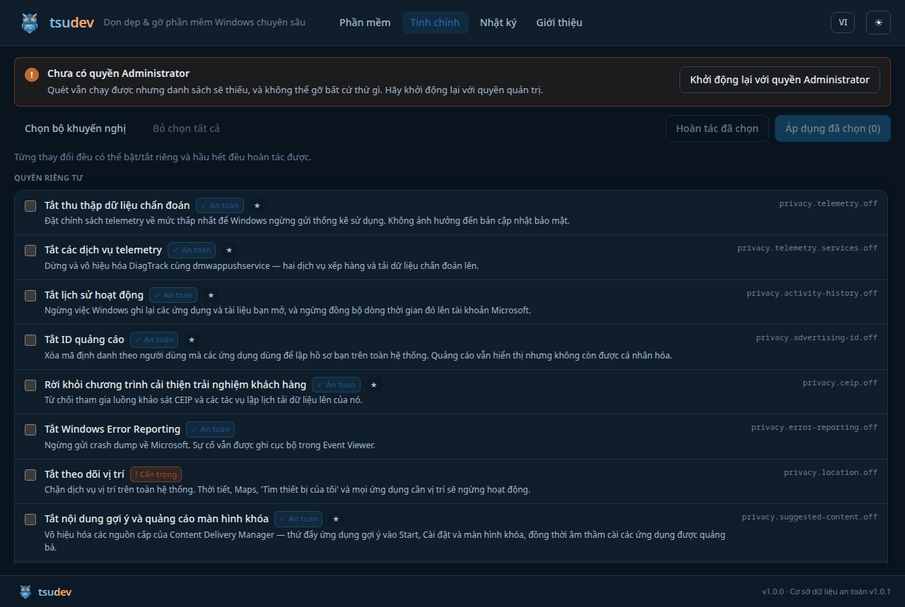
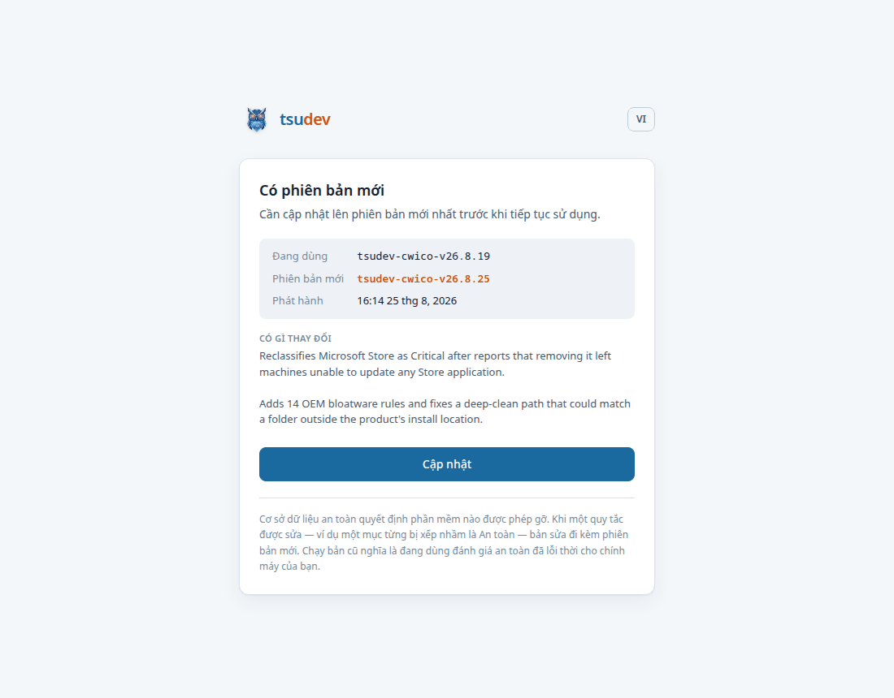
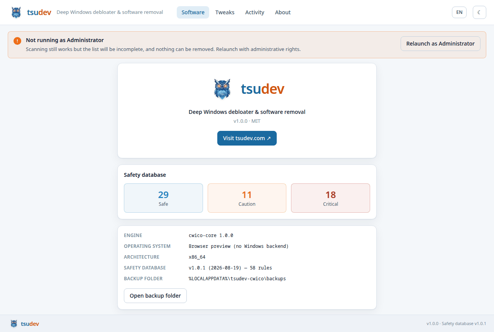

<div align="center">

<a href="https://tsudev.com">
  <picture>
    <source media="(prefers-color-scheme: dark)" srcset="../assets/brand/tsudev-wordmark-dark.png">
    
  </picture>
</a>

<h1>cwico</h1>

**Bộ công cụ rà quét và gỡ bỏ phần mềm Windows chuyên sâu**

[](https://github.com/tsudev-tsudev/tsudev-cwico/actions/workflows/ci.yml)
[](../LICENSE)
[](https://www.rust-lang.org)
[](../data/safety-db.json)

[tsudev.com](https://tsudev.com) · [Bắt đầu](#bắt-đầu) · [Cơ chế an toàn](#cơ-chế-an-toàn) · [English](../README.md)

</div>

---

## Công cụ này làm gì

Windows giấu phần mềm đã cài ở ít nhất sáu nơi khác nhau. `cwico` đọc tất cả,
phân loại mọi thứ tìm được, và cho phép bạn gỡ những gì không cần - mà hệ điều
hành vẫn hoạt động bình thường.

| Lượt quét | Đọc những gì | API Win32 / WinRT |
|---|---|---|
| **Chương trình** | `DisplayName`, `DisplayVersion`, `Publisher`, `UninstallString`, `QuietUninstallString`, `InstallLocation`, `EstimatedSize`, `InstallDate` | `RegOpenKeyExW` trên `HKLM`/`HKCU` `…\Uninstall`, **cả hai** chế độ xem 64-bit và `WOW6432Node` |
| **UWP / AppX** | Tên gói đầy đủ, family name, nhà phát hành, kiến trúc, đường dẫn cài, cờ framework/hệ thống | `Windows.Management.Deployment.PackageManager` |
| **Gói nạp sẵn** | Các gói nằm trong image, tự cài lại cho mọi tài khoản mới | `FindProvisionedPackages` |
| **Dịch vụ** | Tên hiển thị, trạng thái, kiểu khởi động, `ImagePath` | `EnumServicesStatusExW`, `QueryServiceConfigW` |
| **Tác vụ lập lịch** | Đường dẫn đầy đủ, trạng thái bật/tắt, trạng thái chạy | COM `ITaskService` / `ITaskFolder` |
| **Khởi động cùng máy** | `Run`, `RunOnce` (cả hai hive, cả hai chế độ xem) và thư mục Startup | Registry + hệ thống tệp |

Quy trình gỡ bỏ gồm bốn bước cho mỗi mục:

1. **Tắt tiến trình** của phần mềm - `CreateToolhelp32Snapshot`, `OpenProcess`,
   `TerminateProcess`. Các tiến trình dùng chung (`svchost.exe`) và tiến trình
   trọng yếu khi khởi động không bao giờ bị đụng đến.
2. **Chạy trình gỡ chính thức của nhà phát hành**, ở chế độ im lặng. Ưu tiên
   `QuietUninstallString`; nếu không có thì suy ra cờ silent cho MSI, Inno Setup
   và NSIS - và chỉ ba loại đó.
3. **Gỡ gói** - `RemovePackageWithOptionsAsync` với `RemoveForAllUsers`, rồi
   `DeprovisionPackageForAllUsersAsync` để nó không quay lại với tài khoản mới.
4. **Xóa tận gốc** - thư mục và khóa Registry còn sót, mỗi đường dẫn đều phải
   qua bộ chặn an toàn trước.

---

## Giao diện

<div align="center">



*Mỗi dòng đều hiện mức phân loại và **lý do**. Người dùng đang cân nhắc gỡ
Microsoft Edge không phải rê chuột mới biết Windows dùng nó để xem trước PDF.*

<br>



*Không có gì xảy ra trước khi bạn xem kế hoạch: điểm khôi phục và bản xuất
`.reg` chạy trước, rồi đến từng bước cụ thể cho mỗi mục - kèm những gì bộ máy
đã từ chối và lý do.*

<br>



*Tích ô không phải là xác nhận. Mục `Cẩn trọng` và `Chưa rõ` sẽ mở hộp thoại
này, và đây là thứ duy nhất trong giao diện đặt cờ `confirmed` mà bộ máy yêu
cầu.*

<br>



*Mười hai bước cố định của script PowerShell cũ, nay thành 36 thay đổi chọn
riêng được - mỗi thay đổi có mức an toàn, đường hoàn tác và giải thích cái giá
phải trả.*

<br>



*Phát hành một bản mới nghĩa là đẩy cập nhật bắt buộc. Không có nút bỏ qua,
không có "để sau" - chỉ có Cập nhật - vì người dùng chạy bản cũ đang dùng đánh
giá an toàn đã lỗi thời cho chính máy của họ. Nhưng nếu không kiểm tra được,
phần mềm vẫn chạy bình thường: sự cố server không được phép khóa toàn bộ người
dùng cùng lúc.*

<br>



*Mức bảo vệ thực sự đang được nạp, và nơi lưu các bản sao lưu để khôi phục.*

<sub>Ảnh render từ fixture backend (`MockBackend` của `cwico-core`), không phải
kết quả quét máy thật - đây cũng là cách giao diện được phát triển và kiểm tra
mà không cần máy Windows.</sub>

</div>

---

## Cơ chế an toàn

Sự cố tệ nhất của một công cụ debloat là chiếc máy không khởi động được. Có ba
lớp bảo vệ độc lập.

### 1. Phân loại - `data/safety-db.json`

Mỗi mục tìm thấy được đối chiếu với bộ **58 quy tắc**:

| Mức | Ý nghĩa | Số lượng | Ví dụ |
|---|---|---|---|
| **An toàn** | Không ảnh hưởng chức năng của Windows | 29 | OneDrive, Xbox, Candy Crush, Bing News, Skype, dịch vụ telemetry |
| **Cẩn trọng** | Gỡ được nhưng mất một tính năng phụ | 11 | Microsoft Edge, Camera, Photos, Media Player, Cortana, Microsoft Store |
| **Trọng yếu** | Gỡ sẽ hỏng khởi động, đăng nhập, bảo mật hoặc shell | 18 | Defender, File Explorer, Settings, RPC/DCOM/WMI, runtime VC++ và .NET, driver, cấp phép |
| *Chưa rõ* | Không khớp quy tắc nào | - | Mọi phần mềm bên thứ ba cơ sở dữ liệu chưa biết |

Mục không khớp quy tắc nào sẽ là **`Chưa rõ`, không bao giờ là `An toàn`** - cơ
sở dữ liệu mặc định về phía an toàn. Khi một mục khớp cả quy tắc `An toàn` lẫn
`Trọng yếu`, kết quả là `Trọng yếu`: mức nghiêm trọng thắng mức cụ thể.

### 2. Cổng lập kế hoạch - `RemovalPlan::build`

* Mục **Trọng yếu không thể đưa vào kế hoạch.** Không bằng cờ, không bằng xác
  nhận, không từ dòng lệnh. Hàm khởi tạo loại chúng ra và ghi rõ lý do; bộ máy
  kiểm tra lại bất biến này ngay trước khi thực thi.
* Mục **Cẩn trọng và Chưa rõ cần xác nhận riêng cho từng mục.** Thao tác chọn
  hàng loạt "chọn tất cả mục An toàn" không thể tạo ra xác nhận đó.
* Mọi thứ bị từ chối đều được báo lại kèm lý do. Không có gì bị bỏ qua âm thầm.

### 3. Bộ chặn xóa - `cwico_core::guard`

Từ chối thẳng: gốc ổ đĩa, `C:\Windows`, `System32`, `WinSxS`, `Program Files`,
`ProgramData`; thư mục gốc hồ sơ người dùng và dữ liệu cá nhân (`Documents`,
`Desktop`, `Downloads`, `OneDrive`); các thư mục chứa dùng chung (`AppData`,
`Packages`, `Temp`); mọi gốc hive Registry và cơ sở dữ liệu dịch vụ; và bất kỳ
đường dẫn nào còn `%BIẾN%` chưa mở rộng, có `..` hoặc ký tự đại diện.

Điểm phân biệt quan trọng: `C:\Users\tôi\OneDrive` là tệp đồng bộ của người
dùng - tuyệt đối không đụng; còn
`C:\Users\tôi\AppData\Local\Microsoft\OneDrive` là thư mục trạng thái của ứng
dụng - đúng là thứ cần dọn.

### Sao lưu và khôi phục

Trước bước gây thay đổi đầu tiên của mọi phiên chạy:

* **Điểm khôi phục hệ thống** qua `SRSetRestorePointW`. Nếu không tạo được,
  phiên chạy **bị hủy** thay vì tiếp tục mà không có bảo vệ - một cơ chế hoàn
  tác mà bạn không thực hiện được thì không phải là cơ chế hoàn tác.
* **Bản xuất `.reg`** của mọi khóa sẽ can thiệp, ở cả hai chế độ xem, kèm file
  `restore-registry.cmd` để nhập lại mà không cần công cụ này.
* **Nhật ký giao dịch** (JSON) ghi từng bước, kết quả và các đối tượng đã đụng.

Chi tiết đầy đủ: [SAFETY.md](SAFETY.md).

---

## Bắt đầu

### Cài đặt

```powershell
winget install tsudev.cwico
```

Chạy với quyền Administrator. Không có quyền quản trị thì kết quả quét sẽ thiếu
và không gỡ được gì.

### Tự build

```bash
git clone https://github.com/tsudev-tsudev/tsudev-cwico
cd tsudev-cwico

# Test bộ máy - chạy được trên mọi hệ điều hành
cargo test

# Kiểm tra kiểu cho tầng Windows ngay từ Linux/macOS
rustup target add x86_64-pc-windows-gnu
cargo check -p cwico-win --target x86_64-pc-windows-gnu

# Ứng dụng desktop (trên Windows)
npm --prefix ui install
cargo tauri dev
cargo tauri build          # -> bộ cài MSI + NSIS
```

### Dòng lệnh

```bash
cwico info                                   # nền tảng, quyền, số quy tắc
cwico scan --safety safe                     # những gì an toàn để gỡ
cwico scan --json > inventory.json           # xuất dữ liệu để kiểm toán
cwico plan --safe-only --deep-clean          # xem trước điều sẽ xảy ra
cwico remove --name OneDrive --deep-clean --apply
```

Mọi thứ chỉ là chạy thử cho đến khi có `--apply`. `--name` khớp theo ranh giới
từ, nên `--name Edge` chọn *Microsoft Edge* chứ không chọn nhầm
*Acme Ledger Desktop*.

---

## Lộ trình

- [x] Rà quét Registry, AppX, gói nạp sẵn, dịch vụ, tác vụ lập lịch, khởi động cùng máy
- [x] Cơ sở dữ liệu an toàn với lớp Trọng yếu bị chặn cứng
- [x] Điểm khôi phục + hoàn tác `.reg` + nhật ký giao dịch
- [x] Xóa tận gốc có bộ chặn an toàn
- [x] Ứng dụng desktop song ngữ (Việt / Anh)
- [x] CLI headless
- [x] Bộ cài MSI và NSIS, đã build và kiểm chứng trên runner Windows
- [x] Manifest MSIX kèm ghi chú nộp Store
- [x] Manifest `winget` tự sinh khi phát hành

Đã sẵn sàng, chờ điều chỉ bạn cung cấp được:

- [ ] **Chạy thử trên Windows thật.** Mọi thứ compile và test pass trên runner
      Windows, nhưng chưa phiên bản nào thực sự gọi `SRSetRestorePointW` hay
      service control manager trên máy sống. Hãy bắt đầu bằng `cwico plan` -
      lệnh này không thay đổi gì.
- [ ] **Ký số.** Bộ cài chưa ký vẫn chạy được, nhưng SmartScreen sẽ cảnh báo ở
      lần mở đầu - ấn tượng không tốt với công cụ đòi quyền Administrator.
      Đặt `TAURI_SIGNING_PRIVATE_KEY` trong repository secrets.
- [ ] **Nộp Microsoft Store.** Cần tài khoản Partner Center; manifest và ghi
      chú cho người duyệt nằm ở [`packaging/msix/`](../packaging/msix/).
- [ ] **Đăng lên `winget`.** Cần một bản phát hành có tag, rồi gửi pull request
      sang `microsoft/winget-pkgs` kèm manifest đã sinh.

Việc thực sự còn ở tương lai:

- [ ] Port sang Linux (`cwico-linux`: liệt kê apt/dnf/flatpak/snap)
- [ ] Port sang macOS

Trait `PlatformBackend` chính là chỗ để các nền tảng khác cắm vào; bộ máy, mô
hình an toàn và toàn bộ giao diện vốn đã sẵn sàng đa nền tảng.

---

## Quy ước phiên bản

Mỗi bản phát hành được đặt tên theo ngày ra mắt:

| Tình huống | Tên phiên bản |
|---|---|
| Bản đầu tiên ngày 19/8/2026 | `tsudev-cwico-v26.8.19` |
| Bản thứ hai cùng ngày | `tsudev-cwico-v26.8.19.2` |
| Ngày hôm sau | `tsudev-cwico-v26.8.20` |

Bên trong, mỗi tên ánh xạ sang một semver ba số mà phần patch mang cả ngày lẫn
số thứ tự trong ngày (`26.8.1901`) - vì Cargo, bộ đóng gói MSI và bộ cập nhật
đều bắt buộc ba thành phần, và bộ cập nhật *so sánh* chính con số đó để biết
người dùng có đang lạc hậu hay không.

Không bao giờ viết phiên bản bằng tay: `tools/version.py` giữ quy tắc này.

## Cập nhật tự động

Mỗi bản đã cài đặt sẽ kiểm tra bản mới khi khởi động. Nếu xác nhận có bản mới,
toàn bộ giao diện bị thay bằng màn hình chỉ có nút **Cập nhật** - không có
"để sau", không có cách bỏ qua.

Lý do: cơ sở dữ liệu an toàn quyết định phần mềm nào được phép gỡ. Khi một quy
tắc được sửa, bản sửa đi kèm phiên bản mới; người dùng chạy bản cũ đang dùng
đánh giá an toàn đã lỗi thời với quyền Administrator.

Tuy vậy, cổng chặn **chỉ đóng khi đã xác nhận** có bản mới. Lỗi mạng, DNS hỏng
hay GitHub sập thì phần mềm vẫn chạy bình thường kèm một dòng ghi chú nhỏ - vì
sự cố máy chủ không được phép khóa toàn bộ người dùng cùng lúc.

Gói cập nhật được ký; bản đã cài chỉ chấp nhận bản cập nhật ký bằng đúng khóa
đó. Chi tiết: [`SIGNING.md`](SIGNING.md).

---

## Tài liệu

| | |
|---|---|
| [`SAFETY.md`](SAFETY.md) | Cơ sở thiết kế của mọi lớp bảo vệ. Đọc trước khi sửa tầng an toàn. |
| [`RELEASING.md`](RELEASING.md) | Quy trình phát hành. Publish là đẩy cập nhật bắt buộc tới mọi máy. |
| [`SIGNING.md`](SIGNING.md) | Hai loại chữ ký hay bị nhầm lẫn. |
| [`CODE-SIGNING-POLICY.md`](CODE-SIGNING-POLICY.md) | Vai trò nhóm, thứ gì được ký, và phần mềm thu thập gì - không gì cả. |
| [`sessions/STATE.md`](sessions/STATE.md) | Dự án đang ở đâu và làm gì tiếp theo. |
| [`../CONTRIBUTING.md`](../CONTRIBUTING.md) | Code nên đặt ở đâu, chạy kiểm tra thế nào. |
| [`../SECURITY.md`](../SECURITY.md) | Thế nào là lỗi bảo mật ở đây. |

---

## Đóng góp cho cơ sở dữ liệu an toàn

`data/safety-db.json` là file có giá trị nhất trong kho mã này, và cũng dễ đóng
góp nhất. Một quy tắc trông như sau:

```json
{
  "id": "vendor.product",
  "class": "safe",
  "match": { "exact": ["tên sản phẩm"], "kinds": ["registry_uninstall"] },
  "reason": { "en": "Why it is this class.", "vi": "Lý do bằng tiếng Việt." },
  "processes": ["Product.exe"],
  "leftovers": {
    "paths": ["%LOCALAPPDATA%\\Vendor\\Product"],
    "registry": ["HKCU\\Software\\Vendor\\Product"]
  }
}
```

Bắt buộc có cả hai bản dịch `reason` - đã có test kiểm tra. Hãy phân loại theo
hướng thận trọng: phân loại nhầm thành `Cẩn trọng` chỉ tốn của người dùng một
cú nhấp, còn phân loại nhầm thành `An toàn` khiến họ mất một tính năng mà họ
không hề đồng ý đánh đổi.

---

## Giấy phép

MIT © [tsudev](https://tsudev.com)

<div align="center">
<br>
<a href="https://tsudev.com">
  <picture>
    <source media="(prefers-color-scheme: dark)" srcset="../assets/brand/tsudev-wordmark-dark.png">
    
  </picture>
</a>
</div>
